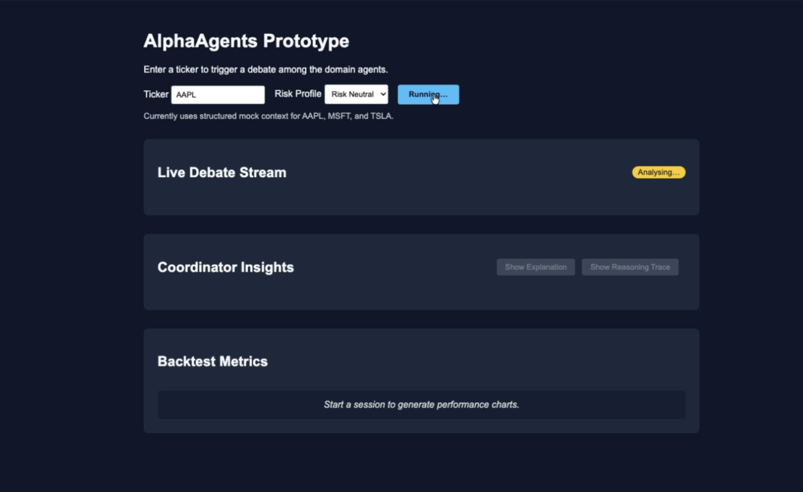
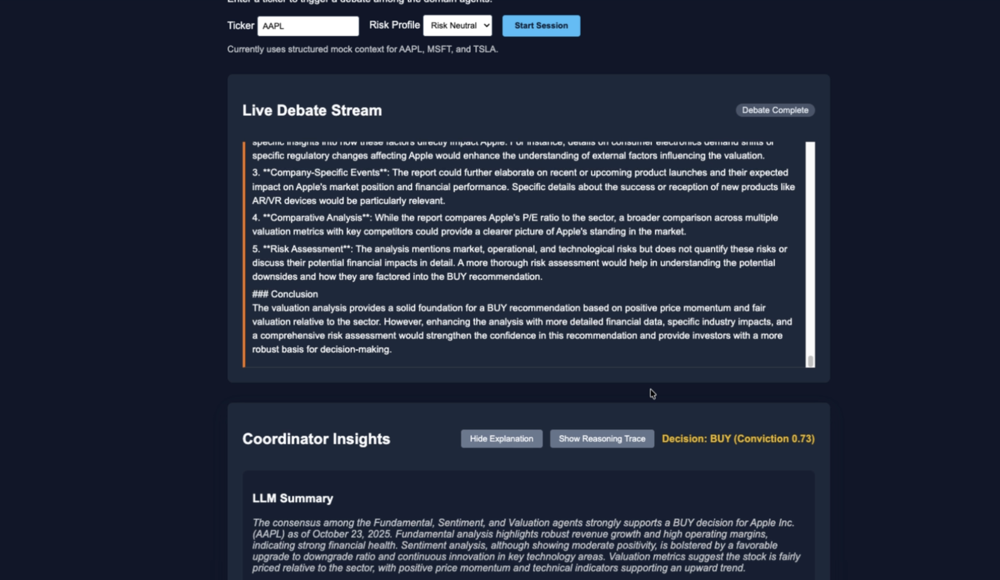

## Hosted Preview (paused)

- The app currently lives at https://alphaagents.onrender.com/ (free Render tier). If the service sits idle, Render auto-suspends it and it spins back up on first request.
- To protect my limited student budget :(, the deployment omits `OPENAI_API_KEY`. Agents run in deterministic fallback mode, so you’ll see the mock narratives rather than live completions.
## Local Walkthrough

1. Create the virtual environment (Python 3.9+):
   ```bash
   python3 -m venv .venv
   source .venv/bin/activate
   pip install -r requirements.txt
   ```
2. Run the smoke tests:
   ```bash
   pytest
   ```
3. Start the API (loads `.env` automatically):
   ```bash
   python -m dotenv run -- uvicorn app.main:app --reload
   ```
4. Visit `http://127.0.0.1:8000/`, hard-refresh, and press **Start Session**. That single click runs the full pipeline (LLM fallbacks if `OPENAI_API_KEY` is missing), populates the debate log, and regenerates the Matplotlib charts. No manual `curl` call is needed unless you want to script the demo.

## Demo Walkthrough


[▶️ Start session demo](docs/media/start-session-demo.mp4) — Click-through recording that shows the button press, the “Analysing…” state, and the debate kicking off in the back.


[▶️ Results walkthrough demo](docs/media/results-walkthrough.mp4) — Scrolling through the post-run UI: coordinator insights, reasoning trace toggle, and regenerated plots.

  Cumulative Return – tracks how $1 invested in the equal-weight portfolio grows over time. Since the mock AAPL path bakes in positive
    drift, you see that steady upward slope, which signals the simulated strategy is “making money” run after run.

  Rolling Sharpe (21-day window) – measures risk-adjusted return over a rolling month. High readings (the mock series hovers around 10)
    mean you’re getting a lot of return per unit of volatility; in real markets you’d expect much lower values once actual price noise comes
    into play.

  Drawdown – shows the depth of drops from the most recent equity peak. The mock track barely dips below zero, so you’re seeing shallow
    troughs that quickly recover. With true market prices, drawdown plots usually reveal deeper, longer-lived “valleys” during sell-offs.


