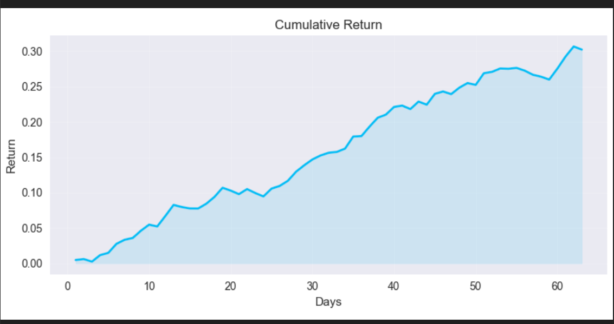
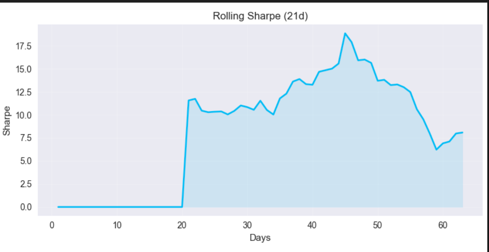
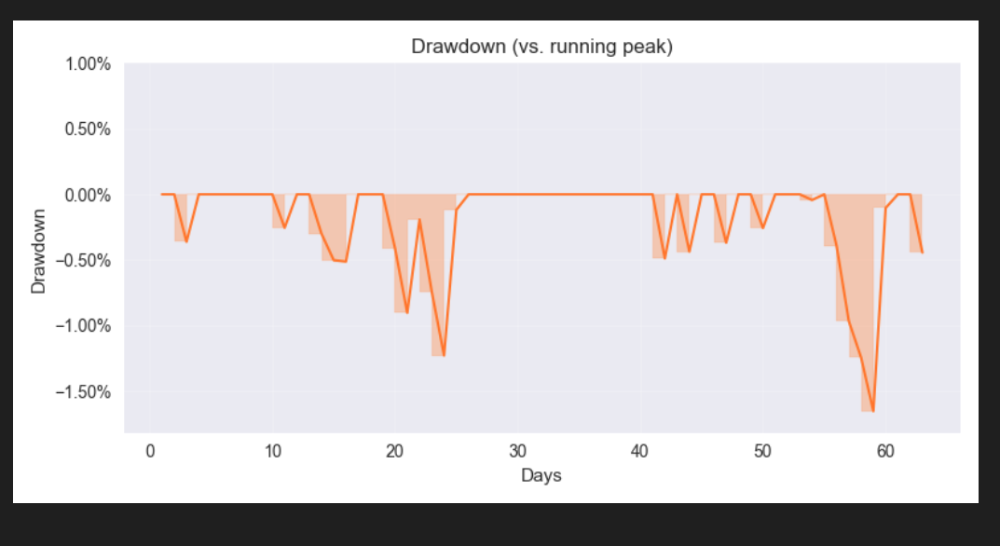

# AlphaAgents Demo Guide

This guide gives product reviewers a quick tour of the prototype and explains how to replay the demo locally now that the hosted preview is paused.

## Hosted Preview (paused)

- The app was deployed on Render using the free FastAPI web service.
- Live LLM calls quickly consumed the OpenAI quota, so the hosted instance now falls back to the mock responses. To avoid unexpected charges, the Render service is currently disabled.
- My credit card balance was not having it :(

## Local Walkthrough

1. Create the virtual environment (Python 3.9+):
   ```bash
   python3 -m venv .venv
   source .venv/bin/activate
   pip install -r requirements.txt
   ```
2. Run the smoke tests:
   ```bash
   pytest
   ```
3. Start the API (loads `.env` automatically):
   ```bash
   python -m dotenv run -- uvicorn app.main:app --reload
   ```
4. Visit `http://127.0.0.1:8000/`, hard-refresh, and press **Start Session**. That single click runs the full pipeline (LLM fallbacks if `OPENAI_API_KEY` is missing), populates the debate log, and regenerates the Matplotlib charts. No manual `curl` call is needed unless you want to script the demo.

## Demo 

| Asset | Description |
|-------|-------------|
| [▶️ Start session demo](docs/media/start-session-demo.mp4) | Recording that shows clicking **Start Session** and the “Analysing…” phase. |
| [▶️ Results walkthrough demo](docs/media/start-session-demo.mp4) | Recording that walks through the debate playback, reasoning trace toggle, and coordinator summary. |
| | Screenshot of the cumulative return plot. |
| | Screenshot of the rolling Sharpe plot. |
|  | Screenshot of the drawdown profile. |

## Known Limitations

- Only the mock tickers (`AAPL`, `MSFT`, `TSLA`) have structured context today.
- LLM calls fall back to deterministic text when the `OPENAI_API_KEY` env var is missing or quota is exhausted.
- The “Live Debate Stream” replays messages after the API call finishes; true streaming will land in a later milestone.
- Render deployment cannot persist the generated PNGs across restarts; re-run `/run_ticker` once per deploy.

## Next Steps

- Replace mock data with live filings/news/prices once data connectors are enabled.
- Improve the front-end to render agent dialogue with richer formatting.
- Automate regeneration of demo assets whenever major UI changes ship.
